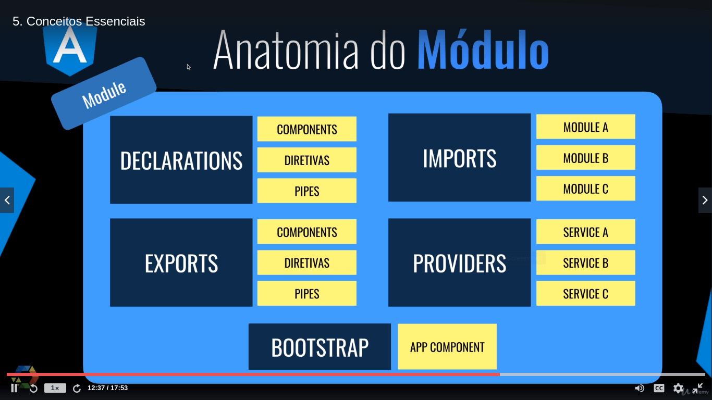

 
# Projeto CRUD com Angular 9 - COD3R
Repositório do curso: https://github.com/cod3rcursos/angular-crud

# Comandos utilizados

Geral

- npm init -y                 => Iniciar o arquivo package.json
- npm i -g @angular/cli       => Command line do Angular
- ng new minha-app            => Criar novo projeto Angular

Angular 

- npm i -g @angular/cli                 => Instalação do Angular CLI (Command Line Interface)
- ng new fronted --minimal              => Criação do profeto frontend (--minimal elimina arquivos desnecessários)
- sudo npm start                        => Inicia a app Angular (executa o "ng serve")
- ng generate component comp/header     => Cria um componente HeaderComponent dentro de "comp"
- ng g c                                => Forma reduzida do comando "ng generate component app-name"

Angular Material

- ng add @angular/material

# TypeScript

Superset do JavaScript.

- Orientada a objetos
- Tipagem forte
- Decorator
- Interfaces

# Preparação do backend

// --- crud/backend

npm init -y
npm i json-server

O JSON Server lê um arquivo que tem um JSON, cira uma API baseada neste JSON.

// --- crud/backend/db.json

```json
{
    "products": [
        {
            "id": 1,
            "name": "Caneta BIC Preta",
            "price": 5.89
        },
        {
            "id": 2,
            "name": "Notebook Mac Pro",
            "price": 12000.89
        },
        {
            "id": 3,
            "name": "Samsumg S20+",
            "price": 5000.89
        }
    ]
}
```

Criou-se um script para iniciar o backend:

```json
"scripts": {
    "start": "json-server --watch db.json --port 3001"
},
```

Exemplos de uso:

GET :: http://localhost:3001/products
POST :: body >> url-encoded
    name: Geladeira
    peice: 1913.99

# Frontend Angular » Árvore de componentes

Exemplo de uma árvore de componente que compõe uma app:

```js
AppComponent (raíz da app)
    Header
        Nav
            List
                Item
                Item
    Content
        ContentTitle
        ProductCrud
            ProductForm
                Input
                Button
```

# Fluxo de inicialização da App


    Nota: O "AppComponent" tem um seletor raiz que vai ser invocado no arquivo index.html.

Em Angular criamos os componentes e podemos colocar esses componenentes dentro de módulos, e definir se estes componentes irão ficar visíveis apenas para dentro do módulo ou se terão visibilidade para fora do módulo.

Existe inicialmente o AppModulo, que é usado para inicializar a App. Dentro do AppModule tem um atributo chamado Bootstrap que aponta para o componente AppComponente (criado por padrão).
O AppComponent faz referência aos demais componentes filhos da App.

# Organização usando módulo

Neste gráfico existe apenas um componente que poderia ficar visível apenas dentro do módulo, o componente "H". Por que? O componente H é apenas referenciado pelo componente "G" está dentro do mesmo módulo do componente "H". Todos os outros componetes são referenciados por componentes que estão em outros módulos, ou seja, todos os outros componentes precisam estar exportos para que possam ser referenciados pelos outro componentes.

Ex: os módulos "E" e "F" precisam estar exportos para fora do módulo para que ele possa ser referenciado pelo componente B.


# Anatomia do módulo



Existem 5 atributos dentro de um módulo, que são usados para configurá-lo:
- Declarations
- Imports
- Exports
- Providers
- Bootstrap

# Criação de app Angular e configs básicas

- npm i -g @angular/cli             Instalação do Angular CLI (Command Line Interface)
- ng new fronted --minimal          Criação do profeto frontend (--minimal elimina arquivos desnecessários)
- sudo npm start                    Inicia a app Angular (executa o "ng serve")

## Configs básicas

Alteração dos atributos inlineTemplate e inlineStyle para "false", para que estejam em arquivos separados, e não na forma inline.

```json
...
        @schematics/angular:component": {
          "inlineTemplate": false,
          "inlineStyle": false,
          "skipTests": true
        },
...
```

# Instalção do Angular Material

- ng add @angular/material

Opções do diálogo selecionadas:
? Choose a prebuilt theme: Indigo/Pink [ Preview: https://material.angular.io?theme=indigo-pink ]
? Set up global Angular Material typography styles? Yes
? Set up browser animations for Angular Material? Yes

# Criação de componente

- ng generate component comp/header     => Cria um componente HeaderComponent dentro de "comp"
- ng g c                                => Forma reduzida do comando "ng generate component app-name"

Formato básico do arquivo **header.component.ts**:

```ts
import { Component, OnInit } from '@angular/core';

@Component({
  selector: 'app-header',
  templateUrl: './header.component.html',
  styleUrls: ['./header.component.css']
})
export class HeaderComponent implements OnInit {

  constructor() { }

  ngOnInit(): void {
  }

}
```

    Após a criação do componente pelo Angular CLI, ele se encarregará de importar e declarar o novo componente no arquivo **app.module.ts**

```ts
import { HeaderComponent } from './components/template/header/header.component';

@NgModule({
    declarations: [
    AppComponent,
    HeaderComponent
    ], ...
})
export class AppModule { }
```

# Aula 16 - Bindins

- Event Binding  
Ligação de evento, ou seja, chamar uma função dentro de uma clsasse de um componente. Ex:
    ```js
    (click)="myFunction()"
    ```

- Binding de atributos  
Atribuir a um atributo de um determinado elemento, um valor que está dentro do seu componente. Ex:
    ```js
    [id]="propertyVariable"
    ```

- Two Way Databinding  
Diretiva não estrutural que liga um campo de formulário aos dados, onde a sua modificação acontece nas duas direções: dados -> formulario e formulario -> dados. Ex:
    ```js
    // Sintae conhecida como "banana na caixa"
    [(ngModel)]="product.name"
    ```
# Conceitos importantes

- Injeção de dependência  
É quando o a linguagem/framework injeta uma dependência dentro de uma determinada classe, ou seja, ela fornece a instancia de algum objeto sem precisar passar isso de forma explícita. Ex:

    ```js
    constructor(private router: Router) { }
    ```
- Singleton  
É uma classe que tem uma única instância. Os valores dos atributos são compartilhados sempre que usar o service, ou seja, estará sendo compartilhado a mesma instância. Ex: ao criar um service, o **"providedIn: root"* indica que se trata de um singleton. Ex de um service usando um snackbar para exibir mensagem:

    ```js
    import { Injectable } from '@angular/core';
    import { MatSnackBar } from'@angular/material/snack-bar';

    @Injectable({
    providedIn: 'root'
    })
    export class ProductService {

    constructor(private snackBar: MatSnackBar) { }

    showMessage(msg: string): void {
        this.snackBar.open(msg, 'X', {
        duration: 3000,
        horizontalPosition: "right",
        verticalPosition: "top"
        }) // mensagem, action, atributos
    }
    }
    ```

# Schematics

Usando o Schematics, já recebemos uma tabela pronta, e a partir desse componente pronto, podemos criar um componente que precisamos de uma forma simples.

Install Schematics  
https://material.angular.io/guide/schematics

# Alterando currency / locale de padrão em dolar

Para alterar o curreny / locale para o Brasil:

// --- html

```html
<td mat-cell *matCellDef="let row">{{row.price | currency: 'BRL'}}</td>
```

// --- app.module.ts

```ts
import { LOCALE_ID } from '@angular/core';
import localePt from '@angular/common/locales/pt'
import { registerLocaleData } from '@angular/common'

registerLocaleData(localePt);

@NgModule({
    providers: [{
    provide: LOCALE_ID,
    useValue: 'pt-BR'
  }]
})
```